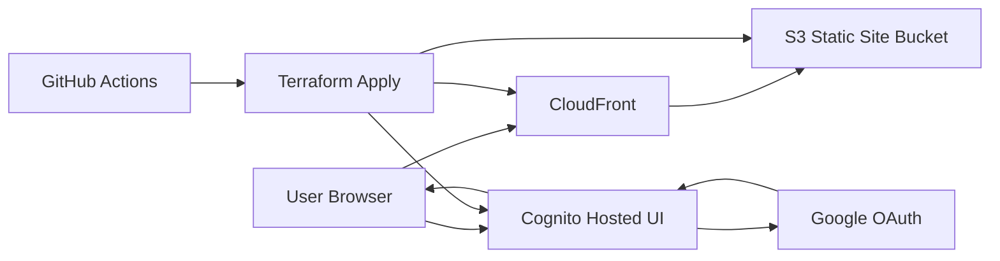
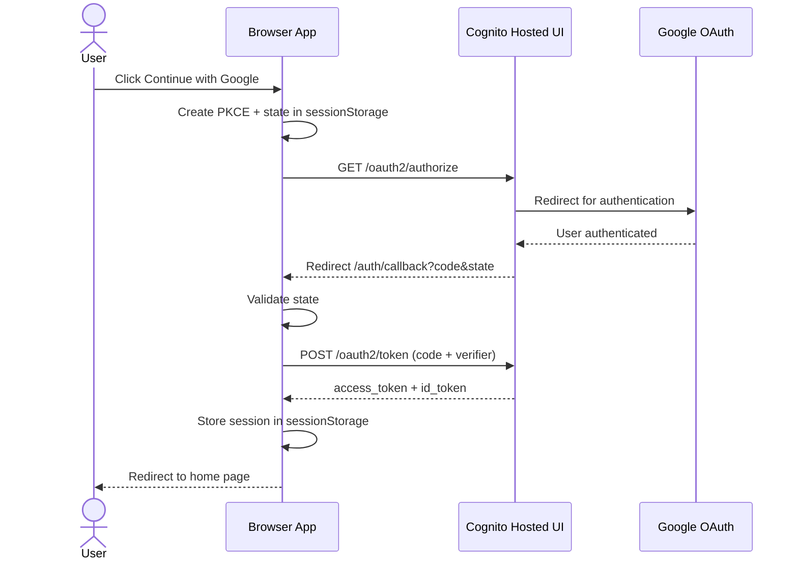
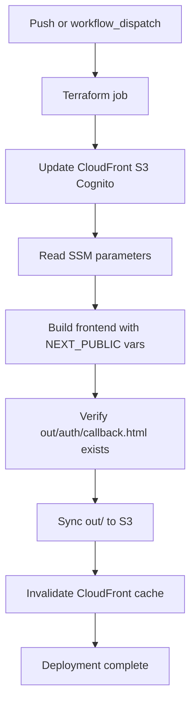

# AWS OAuth 2.0 Example

## Secrets

Use secrets in github actions for CI/CD pipelines.

```text
AWS_ACCESS_KEY_ID
AWS_SECRET_ACCESS_KEY
AWS_REGION
AWS_ACCOUNT_ID
GOOGLE_CLIENT_ID
GOOGLE_CLIENT_SECRET
OPENAI_API_KEY
```

## AWS resources prefix

For all AWS resources, use the following prefix:

```text
rcoauth2
```

## Frontend

### Getting Started

First, run the development server:

```bash
pnpm dev
```

## Backend

to be added

## Architecture Summary

This project is a static Next.js frontend hosted on AWS and authenticated through Cognito + Google.

- Frontend app: Next.js static export (`frontend/out`)
- Static hosting origin: S3 bucket (`rcoauth2-static`)
- CDN/edge: CloudFront (serves app and rewrites extensionless routes)
- Auth broker: Cognito User Pool + Hosted UI
- External identity provider: Google OAuth 2.0
- CI/CD: GitHub Actions (`.github/workflows/frontend.yml`)

Current production entrypoint:

- `https://d2znnfez52b22b.cloudfront.net`

Route53/custom domain is intentionally not used at the moment.



## Google OAuth + Cognito Setup

This project uses Cognito Hosted UI and federates Google as an external identity provider.

Production frontend base URL used for OAuth setup:

- `https://d2znnfez52b22b.cloudfront.net`

In Google Cloud OAuth client settings:

- Authorized redirect URIs:
  - `https://<cognito-domain>/oauth2/idpresponse`
- Authorized JavaScript origins:
  - Not required for Cognito Hosted UI federation. Leave empty unless Google Console requires values.

Example redirect URI for this project:

- `https://rcoauth2-auth.auth.ap-northeast-1.amazoncognito.com/oauth2/idpresponse`

Frontend `.env.local` values are based on `frontend/.env.local.example`.

## Authentication Flow

1. User opens `/login` and clicks `Continue with Google`.
2. Frontend creates PKCE values (`code_verifier`, `code_challenge`) and `state` in `sessionStorage`.
3. Browser is redirected to Cognito Hosted UI `/oauth2/authorize` with `identity_provider=Google`.
4. User authenticates with Google.
5. Cognito redirects browser to `/auth/callback?code=...&state=...` on CloudFront.
6. Callback page validates `state`, then exchanges `code` at Cognito `/oauth2/token`.
7. Frontend stores tokens (and expiry) in `sessionStorage`.
8. Frontend redirects to `/` and renders authenticated user profile.
9. Sign-out clears local session and redirects to Cognito `/logout`.



## Runtime Data Flow

1. Browser requests app routes from CloudFront.
2. CloudFront viewer-request function rewrites extensionless routes:

- `/auth/callback` -> `/auth/callback.html`
- `/login` -> `/login.html`

1. CloudFront fetches static objects from S3 using OAC (private bucket access).
2. For missing paths, CloudFront custom error response falls back to `index.html` for SPA behavior.

## Build and Deploy Data Flow

1. GitHub Actions `frontend.yml` Terraform job applies infra changes.
2. Deploy job reads runtime config from SSM (distribution id, bucket, Cognito settings).
3. Deploy job builds frontend with `NEXT_PUBLIC_*` auth environment variables.
4. Workflow verifies callback export exists (`out/auth/callback.html`) before deploy.
5. Workflow syncs `out/` to S3 and invalidates CloudFront cache.



## Configuration and Secrets Mapping

### GitHub Secrets

- `AWS_ACCESS_KEY_ID`
- `AWS_SECRET_ACCESS_KEY`
- `AWS_REGION`
- `AWS_ACCOUNT_ID`
- `GOOGLE_CLIENT_ID`
- `GOOGLE_CLIENT_SECRET`

### Terraform Inputs

- `google_client_id` <- `TF_VAR_google_client_id`
- `google_client_secret` <- `TF_VAR_google_client_secret`
- `frontend_base_url` currently defaults to CloudFront URL

### SSM Parameters Used by Deploy

- `/rcoauth2/frontend/s3-bucket-name`
- `/rcoauth2/frontend/cloudfront-distribution-id`
- `/rcoauth2/frontend/cognito-user-pool-client-id`
- `/rcoauth2/frontend/cognito-hosted-ui-domain`

### Build-time Frontend Env Vars

- `NEXT_PUBLIC_COGNITO_DOMAIN`
- `NEXT_PUBLIC_COGNITO_CLIENT_ID`
- `NEXT_PUBLIC_COGNITO_REDIRECT_URI`
- `NEXT_PUBLIC_COGNITO_LOGOUT_URI`

## Route53

```text
Not in use for now (using CloudFront URL directly)
```
