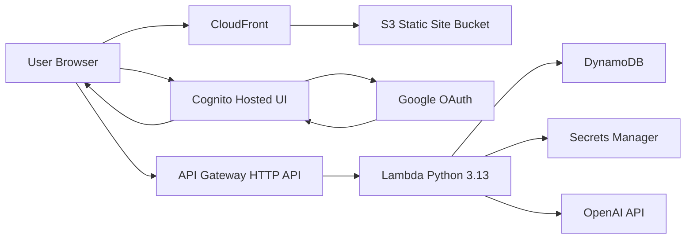
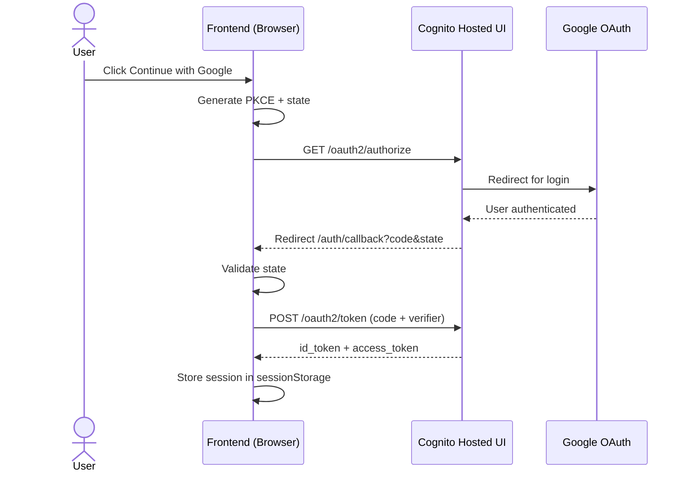
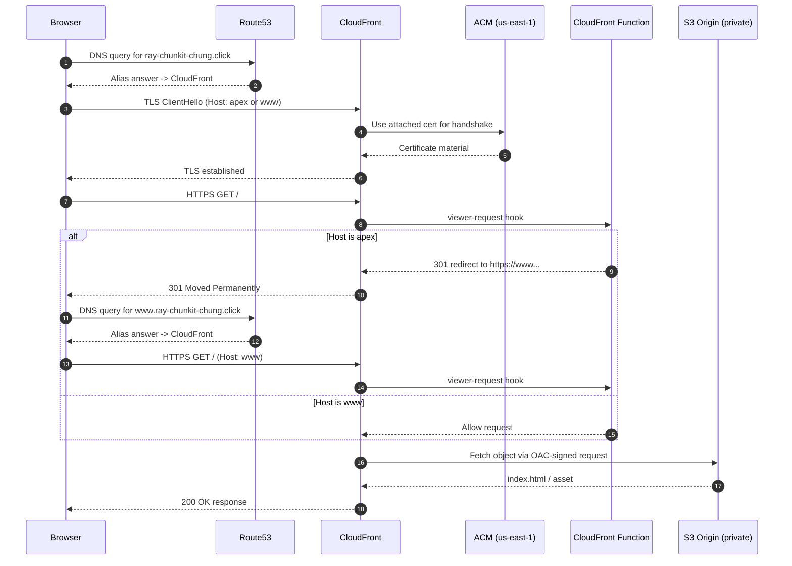

# AWS OAuth 2.0 Example

## Secrets

Use these GitHub Actions secrets for CI/CD:

```text
AWS_ACCESS_KEY_ID
AWS_SECRET_ACCESS_KEY
AWS_REGION
AWS_ACCOUNT_ID
GOOGLE_CLIENT_ID
GOOGLE_CLIENT_SECRET
OPENAI_API_KEY
```

## AWS Resource Prefix

All AWS resources use this prefix:

```text
rcoauth2
```

## Current Architecture

This project is a static Next.js frontend on CloudFront/S3 with Google login via Cognito Hosted UI, plus a Python Lambda chat backend behind API Gateway.

- Frontend app: Next.js static export (`frontend/out`)
- Static hosting: S3 (`rcoauth2-static`)
- CDN/edge: CloudFront + CloudFront Function rewrite
- DNS/TLS: Route53 + ACM (us-east-1) for apex and www custom domains
- Auth broker: Cognito User Pool + Hosted UI domain
- External identity provider: Google OAuth 2.0
- API: API Gateway HTTP API on `api.ray-chunkit-chung.click`
- Compute: Lambda (`python3.13`)
- Data store: DynamoDB (`rcoauth2-chat`)
- Secret store: AWS Secrets Manager (`rcoauth2/backend/openai-api-key`)
- CI/CD: GitHub Actions (`.github/workflows/frontend.yml`, `.github/workflows/backend.yml`)

Production entrypoint:

- `https://www.ray-chunkit-chung.click`

Also supported:

- `https://ray-chunkit-chung.click` (301 redirect to `www`)

Production API endpoint:

- `https://api.ray-chunkit-chung.click`



## Terraform Stack Layout

### Frontend Stack (`infra/frontend`)

Creates and maintains:

- S3 bucket + restrictive public access policy
- CloudFront distribution + OAC + route rewrite function
- ACM certificate validation + Route53 apex/www alias records
- Cognito user pool, Google identity provider, domain, app client
- SSM parameters used by frontend deploy and backend auth setup

### Backend Stack (`infra/backend`)

Creates and maintains:

- Lambda function + IAM role/policy + log group
- API Gateway HTTP API + JWT authorizer + routes + stage
- API Gateway custom domain (`api.ray-chunkit-chung.click`) + DNS + ACM validation
- Default `execute-api` endpoint disabled (custom domain only)
- DynamoDB chat table
- Secrets Manager secret metadata (secret value injected by CI)
- SSM parameters for backend runtime/config lookup

Terraform state backend for backend stack:

- S3 state file: `s3://rcoauth2-terraform-state/backend/terraform.tfstate`
- Locking table: `rcoauth2-terraform-locks`

Backend Terraform guide for detailed planning and refactor notes:

- `infra/backend/README.md`

## Cross-Stack Contracts (SSM)

Backend reads frontend-created Cognito values:

- `/rcoauth2/frontend/cognito-user-pool-id`
- `/rcoauth2/frontend/cognito-user-pool-client-id`

Frontend deploy reads backend-created API value:

- `/rcoauth2/backend/chat-api-url`

Backend also writes:

- `/rcoauth2/backend/openai-secret-arn`
- `/rcoauth2/backend/chat-table-name`

## Authentication Flow (Browser + Cognito + Google)

Frontend implementation uses Authorization Code + PKCE in the browser.

1. User opens `/login` and clicks Continue with Google.
2. Frontend generates `code_verifier`, `code_challenge`, and `state`.
3. Browser is redirected to Cognito `/oauth2/authorize` with `identity_provider=Google`.
4. User completes Google auth; Cognito redirects to `/auth/callback?code=...&state=...`.
5. Callback page verifies `state` from session storage.
6. Frontend exchanges `code` at Cognito `/oauth2/token`.
7. Frontend stores `id_token`, `access_token`, and expiry in `sessionStorage`.
8. Frontend uses the `id_token` as `Authorization: Bearer ...` for chat API requests.
9. Sign-out clears browser session and redirects to Cognito `/logout`.



## Runtime Data Flow

### Frontend Runtime

1. Browser loads static pages from CloudFront.
2. CloudFront function rewrites extensionless routes, for example:
   - `/login` -> `/login.html`
   - `/auth/callback` -> `/auth/callback.html`
3. CloudFront fetches objects from private S3 via OAC.
4. 403/404 responses are mapped to `index.html` for SPA fallback.
5. Frontend checks local session state:
   - unauthenticated users are redirected to `/login`
   - authenticated users can load sessions/messages
6. Chat UI behavior: message composer uses `Enter` for newline and `Shift+Enter` to send, and users can delete a single session from the sidebar.

### Backend Runtime

Routes:

- `GET /chat/health` (public)
- `GET /chat/sessions` (JWT required)
- `GET /chat/sessions/{sessionId}` (JWT required)
- `DELETE /chat/sessions/{sessionId}` (JWT required)
- `POST /chat/messages` (JWT required)

Message request lifecycle (`POST /chat/messages`):

1. Validate JWT and extract Cognito `sub`.
2. Validate input (`message`, optional `sessionId`, max length).
3. Create session when needed (title generated from first message).
4. Save user message in DynamoDB.
5. Load bounded message history and call OpenAI.
6. Save assistant message.
7. Update session metadata (`updatedAt`, preview, message count).
8. Return updated session + both messages.

Delete session lifecycle (`DELETE /chat/sessions/{sessionId}`):

1. Validate JWT and extract Cognito `sub`.
2. Validate `sessionId` path parameter.
3. Verify the target session belongs to the authenticated user.
4. Query all messages under that session.
5. Delete all matching message items and the session metadata item.
6. Return deletion summary (`sessionId`, `deletedMessageCount`).

Data isolation model:

- Partition key: `USER#{sub}`
- Session sort key: `SESS#{sessionId}`
- Message sort key: `MSG#{sessionId}#{timestamp}#{messageId}`

This enforces per-user isolation by Cognito subject.

## CI/CD Data Flow

### Frontend Workflow (`.github/workflows/frontend.yml`)

1. Terraform job applies frontend infrastructure.
2. Deploy job reads SSM + CloudFront values.
3. Build injects `NEXT_PUBLIC_*` auth and API variables.
4. Verifies `out/auth/callback.html` exists.
5. Syncs static export to S3.
6. Invalidates CloudFront cache.

### Backend Workflow (`.github/workflows/backend.yml`)

1. Builds Lambda package (`backend/build.sh` -> `backend/dist/lambda.zip`).
2. Runs Terraform init/fmt/validate/plan/apply in `infra/backend`.
3. Reads backend SSM values (`chat-api-url`, `openai-secret-arn`).
4. Updates secret value in Secrets Manager from `OPENAI_API_KEY`.
5. Runs health endpoint smoke test.

## Configuration Mapping

### Frontend Build-Time Env Vars

- `NEXT_PUBLIC_COGNITO_DOMAIN`
- `NEXT_PUBLIC_COGNITO_CLIENT_ID`
- `NEXT_PUBLIC_COGNITO_REDIRECT_URI`
- `NEXT_PUBLIC_COGNITO_LOGOUT_URI`
- `NEXT_PUBLIC_CHAT_API_BASE_URL`

### Terraform Inputs

- Frontend: `google_client_id`, `google_client_secret`
- Backend: `project_prefix`, `frontend_base_url`, `frontend_root_domain`, `api_domain_name`, `openai_model`, `enable_lambda_warmup`, `lambda_warmup_interval_minutes`

## Local Development Notes

### Frontend

```bash
pnpm dev
```

### Backend Terraform Validate Pitfall

`terraform validate` for `infra/backend` will fail if Lambda zip is missing because `filebase64sha256` reads:

- `../../backend/dist/lambda.zip`

Build it first:

```bash
chmod +x backend/build.sh
./backend/build.sh
```

## Custom Domain and ACM Setup

This project provisions and wires the custom domain entirely from Terraform in [infra/frontend/domain.tf](infra/frontend/domain.tf) and [infra/frontend/main.tf](infra/frontend/main.tf).

Backend custom domain is also provisioned from Terraform in [infra/backend/main.tf](infra/backend/main.tf).

### Why this exists

CloudFront distributions have a default hostname, but production apps usually need a branded domain and HTTPS. This setup gives you:

- Friendly URLs (`www.ray-chunkit-chung.click`)
- Automatic HTTPS at the edge (ACM certificate attached to CloudFront)
- DNS ownership and routing through Route53
- Canonical host behavior (apex redirected to `www`)

### Prerequisite

- A public Route53 hosted zone must already exist for `ray-chunkit-chung.click`.

### Components and responsibilities

- Route53 hosted zone: owns DNS records for the domain.
- ACM certificate in `us-east-1`: provides TLS certificate for CloudFront.
- CloudFront distribution: serves frontend content and terminates TLS.
- CloudFront Function: enforces allowed hosts and redirects apex to `www`.
- Route53 alias records: map apex and `www` DNS names to CloudFront.

### Provisioning flow (Terraform apply)

1. Terraform creates an ACM certificate in `us-east-1` for `www.ray-chunkit-chung.click` with `ray-chunkit-chung.click` as a SAN.
2. Terraform creates Route53 DNS validation records from the ACM domain validation options.
3. Terraform validates the certificate and then attaches the validated cert ARN to CloudFront.
4. CloudFront is configured with both aliases (`ray-chunkit-chung.click` and `www.ray-chunkit-chung.click`).
5. Route53 alias records (`A` and `AAAA`) for both apex and `www` point to the CloudFront distribution.
6. The CloudFront Function only allows those two host headers, redirects apex to `www`, and rejects unexpected hosts.

### Request flow (what happens in the browser)

1. User opens `https://ray-chunkit-chung.click` or `https://www.ray-chunkit-chung.click`.
2. DNS lookup goes to Route53 and resolves to CloudFront.
3. Browser performs TLS handshake with CloudFront using the ACM certificate.
4. If host is apex, CloudFront Function returns `301` to `https://www...`.
5. If host is `www`, CloudFront serves static assets from S3 via OAC.

ASCII overview:

```text
                     +------------------------------+
                     | Route53 Hosted Zone          |
                     | ray-chunkit-chung.click      |
                     +---------------+--------------+
                                     |
                    A/AAAA alias for apex and www
                                     |
                                     v
                     +------------------------------+
Browser HTTPS -----> | CloudFront Distribution      |
request              | aliases: apex + www          |
                     | cert: ACM (us-east-1)        |
                     +---------------+--------------+
                                     |
                      viewer-request CloudFront Function
                      - allow only apex/www
                      - apex -> 301 -> https://www...
                                     |
                                     v
                     +------------------------------+
                     | S3 Bucket (private origin)   |
                     | rcoauth2-static              |
                     +------------------------------+
```

Mermaid sequence view:



### Related frontend Terraform inputs

- `frontend_root_domain`
- `frontend_www_domain`
- `frontend_base_url`

## Backend API Custom Domain

Backend API traffic is served through `https://api.ray-chunkit-chung.click`.

Provisioned in Terraform ([infra/backend/main.tf](infra/backend/main.tf)):

- ACM certificate in API region (`ap-northeast-1`) with DNS validation
- API Gateway HTTP API custom domain + mapping to `$default` stage
- Route53 `A` and `AAAA` alias records for `api.ray-chunkit-chung.click`
- API Gateway default `execute-api` endpoint disabled
- SSM parameter `/rcoauth2/backend/chat-api-url` published as custom domain URL

Verification checks:

1. `https://api.ray-chunkit-chung.click/chat/health` returns `200`.
2. Default `execute-api` URL is inaccessible.
3. Frontend chat requests continue working via `NEXT_PUBLIC_CHAT_API_BASE_URL`.

### Why ACM must be in us-east-1

CloudFront is a global service and only supports ACM certificates from `us-east-1` for viewer certificates. A cert in another region will not attach to CloudFront.

### How this interacts with Cognito redirects

`frontend_base_url` is used by Terraform and deploy steps to build Cognito callback/logout URLs. Keep it aligned with your canonical domain (`https://www...`) so login redirects stay consistent.

### Change checklist (domain migration)

If you move to a new domain, update these values first, then apply Terraform:

1. `frontend_root_domain`
2. `frontend_www_domain`
3. `frontend_base_url`
4. `cognito_domain_prefix` (only if you also want a new Hosted UI subdomain)

After apply:

1. Confirm ACM validation is `ISSUED`.
2. Confirm CloudFront distribution has both aliases.
3. Confirm Route53 apex and `www` alias records point to the distribution.
4. Confirm `https://apex` redirects to `https://www`.
5. Re-run frontend deployment so environment values and static assets are in sync.

### Common troubleshooting

- Browser shows certificate mismatch:
  Usually means CloudFront is still using old cert/aliases, or DNS has not fully propagated.
- Domain does not resolve:
  Check hosted zone delegation at registrar and verify Route53 alias records exist.
- `www` works but apex does not redirect:
  Check CloudFront Function association on `viewer-request`.
- OAuth callback errors after domain change:
  Re-check `frontend_base_url` and Cognito app client callback/logout URLs.

### Operational notes

- ACM certificate for CloudFront must stay in `us-east-1`.
- If you change domains, update the frontend Terraform variables and re-apply.
- Keep `frontend_base_url` aligned with the canonical `https://www...` URL used for Cognito callback/logout settings.

## Route53

Route53/custom domains are in use.

- Apex: `ray-chunkit-chung.click`
- Canonical: `www.ray-chunkit-chung.click`
- API: `api.ray-chunkit-chung.click`
- Apex requests are redirected to `www` by the CloudFront Function.
